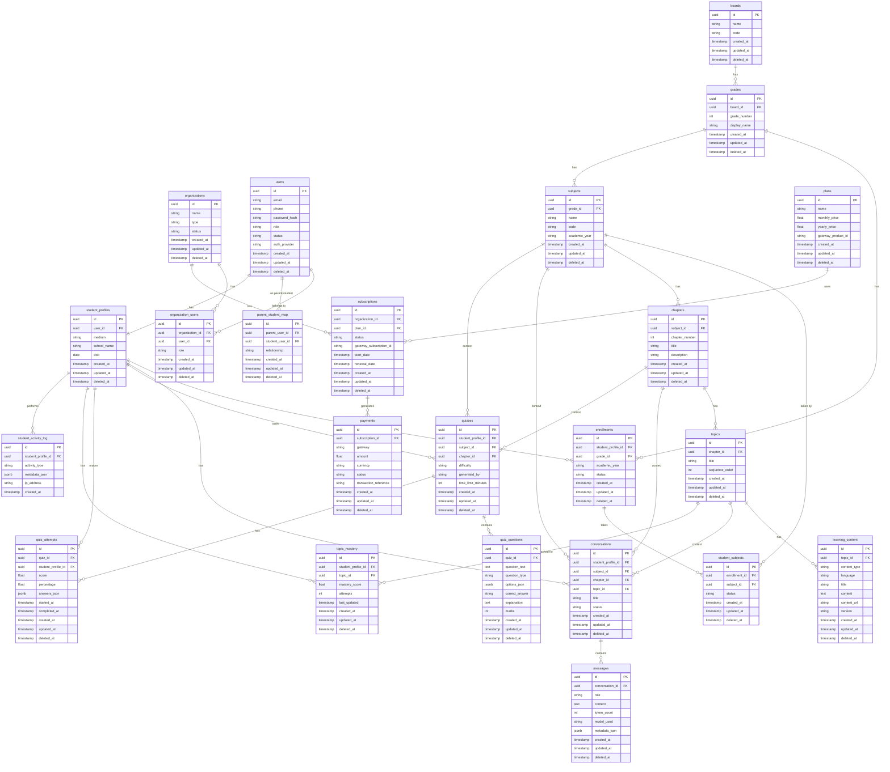

```mermaid
erDiagram
    organizations {
        uuid id PK
        string name
        string type
        string status
        timestamp created_at
        timestamp updated_at
        timestamp deleted_at
    }
    
    users {
        uuid id PK
        string email
        string phone
        string password_hash
        string role
        string status
        string auth_provider
        timestamp created_at
        timestamp updated_at
        timestamp deleted_at
    }

    organization_users {
        uuid id PK
        uuid organization_id FK
        uuid user_id FK
        string role
        timestamp created_at
        timestamp updated_at
        timestamp deleted_at
    }

    parent_student_map {
        uuid id PK
        uuid parent_user_id FK
        uuid student_user_id FK
        string relationship
        timestamp created_at
        timestamp updated_at
        timestamp deleted_at
    }

    student_profiles {
        uuid id PK
        uuid user_id FK
        string medium
        string school_name
        date dob
        timestamp created_at
        timestamp updated_at
        timestamp deleted_at
    }

    enrollments {
        uuid id PK
        uuid student_profile_id FK
        uuid grade_id FK
        string academic_year
        string status
        timestamp created_at
        timestamp updated_at
        timestamp deleted_at
    }

    student_subjects {
        uuid id PK
        uuid enrollment_id FK
        uuid subject_id FK
        string status
        timestamp created_at
        timestamp updated_at
        timestamp deleted_at
    }

    boards {
        uuid id PK
        string name
        string code
        timestamp created_at
        timestamp updated_at
        timestamp deleted_at
    }

    grades {
        uuid id PK
        uuid board_id FK
        int grade_number
        string display_name
        timestamp created_at
        timestamp updated_at
        timestamp deleted_at
    }

    subjects {
        uuid id PK
        uuid grade_id FK
        string name
        string code
        string academic_year
        timestamp created_at
        timestamp updated_at
        timestamp deleted_at
    }

    chapters {
        uuid id PK
        uuid subject_id FK
        int chapter_number
        string title
        string description
        timestamp created_at
        timestamp updated_at
        timestamp deleted_at
    }

    topics {
        uuid id PK
        uuid chapter_id FK
        string title
        int sequence_order
        timestamp created_at
        timestamp updated_at
        timestamp deleted_at
    }

    learning_content {
        uuid id PK
        uuid topic_id FK
        string content_type
        string language
        string title
        text content
        string content_url
        string version
        timestamp created_at
        timestamp updated_at
        timestamp deleted_at
    }

    conversations {
        uuid id PK
        uuid student_profile_id FK
        uuid subject_id FK
        uuid chapter_id FK
        uuid topic_id FK
        string title
        string status
        timestamp created_at
        timestamp updated_at
        timestamp deleted_at
    }

    messages {
        uuid id PK
        uuid conversation_id FK
        string role
        text content
        int token_count
        string model_used
        jsonb metadata_json
        timestamp created_at
        timestamp updated_at
        timestamp deleted_at
    }

    quizzes {
        uuid id PK
        uuid student_profile_id FK
        uuid subject_id FK
        uuid chapter_id FK
        string difficulty
        string generated_by
        int time_limit_minutes
        timestamp created_at
        timestamp updated_at
        timestamp deleted_at
    }

    quiz_questions {
        uuid id PK
        uuid quiz_id FK
        text question_text
        string question_type
        jsonb options_json
        string correct_answer
        text explanation
        int marks
        timestamp created_at
        timestamp updated_at
        timestamp deleted_at
    }

    quiz_attempts {
        uuid id PK
        uuid quiz_id FK
        uuid student_profile_id FK
        float score
        float percentage
        jsonb answers_json
        timestamp started_at
        timestamp completed_at
        timestamp created_at
        timestamp updated_at
        timestamp deleted_at
    }

    topic_mastery {
        uuid id PK
        uuid student_profile_id FK
        uuid topic_id FK
        float mastery_score
        int attempts
        timestamp last_updated
        timestamp created_at
        timestamp updated_at
        timestamp deleted_at
    }

    student_activity_log {
        uuid id PK
        uuid student_profile_id FK
        string activity_type
        jsonb metadata_json
        string ip_address
        timestamp created_at
    }

    plans {
        uuid id PK
        string name
        float monthly_price
        float yearly_price
        string gateway_product_id
        timestamp created_at
        timestamp updated_at
        timestamp deleted_at
    }

    subscriptions {
        uuid id PK
        uuid organization_id FK
        uuid plan_id FK
        string status
        string gateway_subscription_id
        timestamp start_date
        timestamp renewal_date
        timestamp created_at
        timestamp updated_at
        timestamp deleted_at
    }

    payments {
        uuid id PK
        uuid subscription_id FK
        string gateway
        float amount
        string currency
        string status
        string transaction_reference
        timestamp created_at
        timestamp updated_at
        timestamp deleted_at
    }

    %% Relationships
    organizations ||--o{ organization_users : "has"
    users ||--o{ organization_users : "belongs to"
    users ||--o{ parent_student_map : "as parent/student"
    users ||--|| student_profiles : "has"
    student_profiles ||--o{ enrollments : "enrolled in"
    grades ||--o{ enrollments : "has"
    enrollments ||--o{ student_subjects : "takes"
    subjects ||--o{ student_subjects : "taken by"
    boards ||--o{ grades : "has"
    grades ||--o{ subjects : "has"
    subjects ||--o{ chapters : "has"
    chapters ||--o{ topics : "has"
    topics ||--o{ learning_content : "has"
    student_profiles ||--o{ conversations : "has"
    conversations ||--o{ messages : "contains"
    subjects ||--o{ conversations : "context"
    chapters ||--o{ conversations : "context"
    topics ||--o{ conversations : "context"
    student_profiles ||--o{ quizzes : "takes"
    subjects ||--o{ quizzes : "context"
    chapters ||--o{ quizzes : "context"
    quizzes ||--o{ quiz_questions : "contains"
    quizzes ||--o{ quiz_attempts : "has"
    student_profiles ||--o{ quiz_attempts : "makes"
    student_profiles ||--o{ topic_mastery : "has"
    topics ||--o{ topic_mastery : "tracked for"
    student_profiles ||--o{ student_activity_log : "performs"
    organizations ||--o{ subscriptions : "has"
    plans ||--o{ subscriptions : "uses"
    subscriptions ||--o{ payments : "generates"
```
